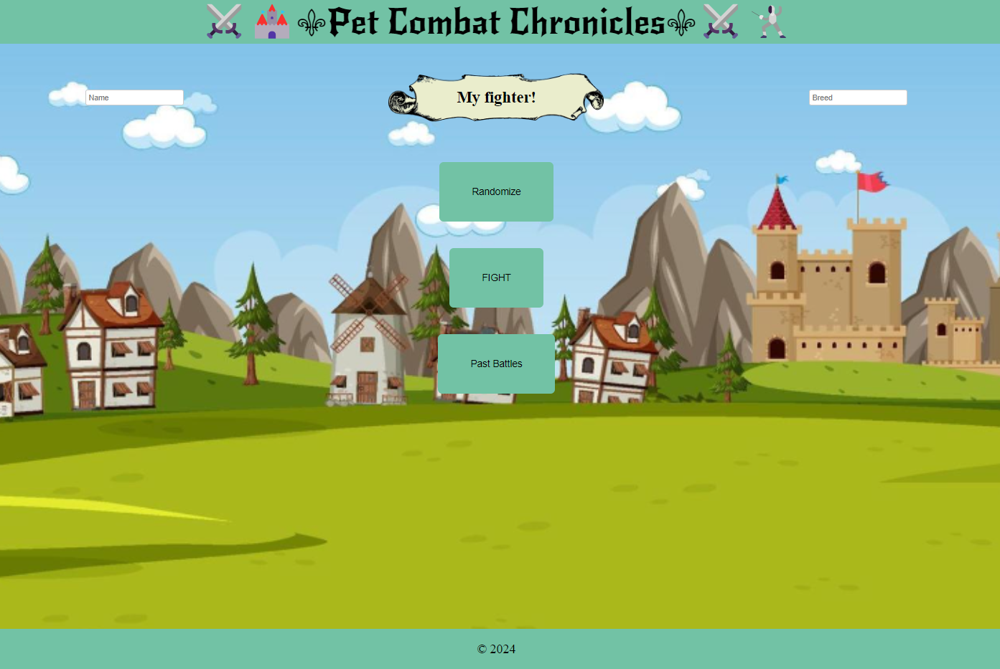

# Pet-Combat-Chronicles
An amazing website that allows me to virtually battle with a random selected dog and shows a fact about this pet.

## User Story
AS AN animal lover

I WANT to be able to create a user-friendly game

SO THAT my chosen pet can virtually battle another random pet

## Acceptance Criteria
GIVEN the Pet Combat Chronicles webpage

WHEN I click on randomize based on a RNG THEN the CPU and I are assigned a random dog to battle 

WHEN I click on “battle” THEN the user will receive battle boost based on a back end dice roll, as well as the cpu. Whoever has the higher stats wins the battle

WHEN I finish a battle THEN I will see a fact about the winning dog

## API's used
- Dog API: Fetching dog breeds information.
https://dogapi.dog/docs/api-v2

- Dog CEO API: Fetching random dog images for battles.
https://dog.ceo/dog-api/

## Mock-up

## Acknowledgements
Special thanks to our TA's Mateo Wallace & Mark Alfano for giving us support. Last but not least, to our instructor Darian Mendez for teaching us everything we know.

## Collaborators
1. Dennis Heitt = https://github.com/Mitchell-610
2. Elisse Gomez - https://github.com/elissegomez24
3. Erin Spix - https://github.com/erinspix
4. Rubyann Baibo - https://github.com/rubyannB
5. Susana Soto - https://github.com/ssoto83

## URL
https://github.com/Mitchell-610/Pet-Combat-Chronicles

