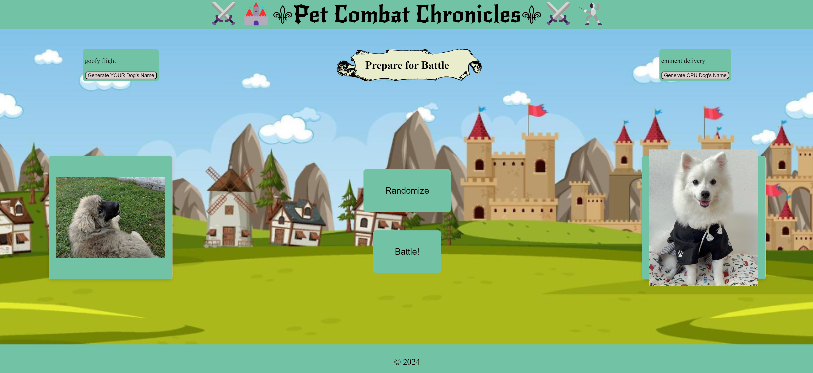
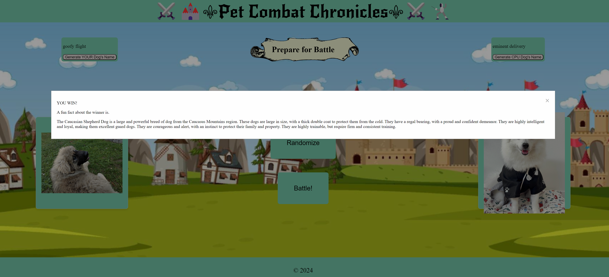

# Pet-Combat-Chronicles
An amazing website that allows me to virtually battle with a random selected dog and shows a fact about this pet.

## User Story
AS AN animal lover

I WANT to be able to play a furry user-friendly game

SO THAT my virtually selected pet can battle a random pet and I learn something new about the winning pet.

## Acceptance Criteria
GIVEN the Pet Combat Chronicles webpage

WHEN I click on 'Generate YOUR Dog's Name' and 'Generate CPU Dog's Name' THEN a randomly selected combination of names from the database its assigned and displayed

WHEN I click on 'Randomize' and based on a RNG THEN the CPU and I are assigned a random dog to battle and an image for each dog is shown

WHEN I click on 'battle!' THEN a winner is chosen based on their breed, specified parameters and a battle boost provided by a back end dice roll

WHEN I finish a battle THEN I will a pop up will appear with a 'You win' or 'You lose'm message along with a fact about the winning dog

WHEN I dismiss the fact about the winning dog THEN I can randomize and battle all over 

## API's used
* Dog API: Fetching dog breeds information 'https://dogapi.dog/docs/api-v2'

* Dog CEO API: Fetching random dog images for battles 'https://dog.ceo/dog-api/'

## Mock-up

## Acknowlegements
Special thanks to our TA's Mateo Wallace & Mark Alfano for giving us support. Last but not least, to our instructor Darian Mendez for teaching us everything we know.

## Collaborators
1. Dennis Heitt = https://github.com/Mitchell-610
2. Elisse Gomez - https://github.com/elissegomez24
3. Erin Spix - https://github.com/erinspix
4. Rubyann Baibo - https://github.com/rubyannB
5. Susana Soto - https://github.com/ssoto83

## URL
https://github.com/Mitchell-610/Pet-Combat-Chronicles

GIVEN the Pet Combat Chronicles webpage

WHEN I click on randomize based on a RNG 
THEN I am assigned with a dog to battle & the cpu is assigned a dog to battle .

WHEN I click on “battle”
THEN the user will receive battle boost based on a back end dice roll, as well as the cpu.
Whoever has the higher stats wins the battle

WHEN i finish a battle
THEN I will see a fact about the winning dog

